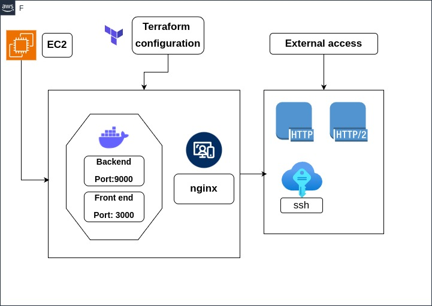

# Weatherapp

In this project, I containerized both the front-end and back-end applications using Docker. After that, I created a Docker Compose file to define and manage these two containerized applications. We utilized the OpenWeatherMap API to retrieve weather forecasting data Unfortunately, we did not implement code to visualize the API data on our front end. To make the application public and share it with others, I used AWS as the cloud hosting tool. I created an EC2 instance, and inside this instance, our application is running as a containerized service. Here is how our system looks like:

Using Certbot, I established a secure connection to our DNS, which is a free DuckDNS server. You can access the web application at [adiya-weather.duckdns.org](https://adiya-weather.duckdns.org/)

Our public IP address is 3.76.44.180, and I have uploaded the .pem key file in this repository, allowing SSH connection to the EC2 instance for further inspection. To connect via SSH, use the following command:
 `ssh -i weatherapp.pem ubuntu@3.76.44.180`

The Terraform configuration in this project is used to automate the infrastructure setup for the weather app. It provisions an AWS EC2 instance configured to run Docker containers for the frontend and backend services of the application. The configuration includes setting up necessary security groups to manage access and ensure secure communication between the services. The EC2 instance is initialized with a user data script that installs Docker, starts the Docker service, and runs the weather app containers. This approach ensures that the infrastructure can be easily recreated, managed, and maintained consistently across different environments.
